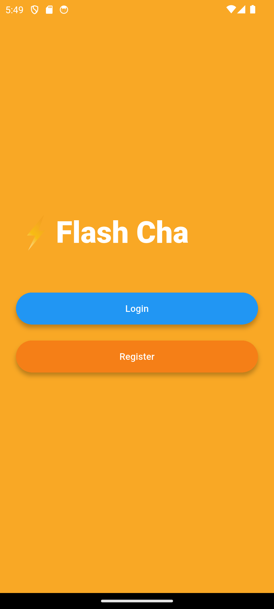
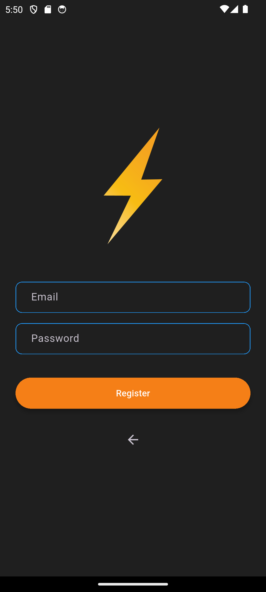
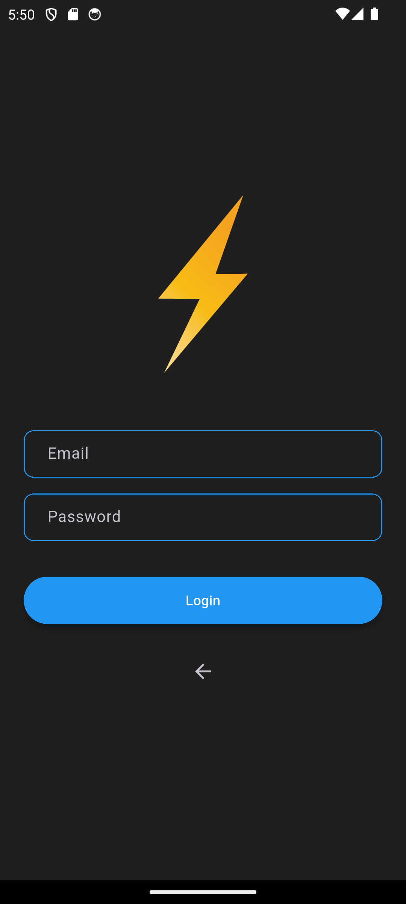
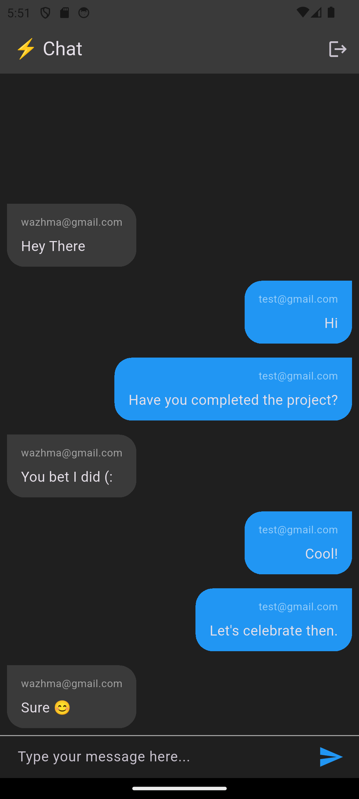

# Flash Chat APP Project

A real-time chat application built with **Flutter**, featuring secure **Firebase** authentication and a fully integrated Firebase backend. The app supports user registration and login with email and password, and once authenticated, users can exchange messages instantly on the chat screen. All chat messages are persistently stored in Firebase, ensuring seamless synchronization across devices and a reliable messaging history.

## App Preview

| Welcom Page | Login Page | Register Page| Chat Screen |

<table align="center">
  <tr>
    <td align="center">
      
      <br />
      <em>Welcome Screen</em>
    </td>
    <td align="center">
      
      <br />
      <em>Register Screen</em>
    </td>
  </tr>
  <tr>
    <td align="center">
      
      <br />
      <em>Login Screen</em>
    </td>
    <td align="center">
      
      <br />
      <em>Chat Screen</em>
    </td>
  </tr>
</table>

## Technologies Used

- **Flutter** - For frontend UI
- **Firebase** - For Backend and Database storage

## How to run

### Prerequisites

- Flutter SDK installed ([Installation Guide](https://flutter.dev/docs/get-started/install))
- Android Studio / VS Code with Flutter extensions
- Android emulator or physical device

### Steps

1. Clone the Repository

```bash
https://github.com/WazhmaHakimi/Flash_Chat_App.git
```

2. Open the project in Andriod Studio or any IDE that you use

3. Run this command to get all the dependencies

```bash
flutter pub get
```

4. Then run this command to run the project.

```bash
flutter run
```
